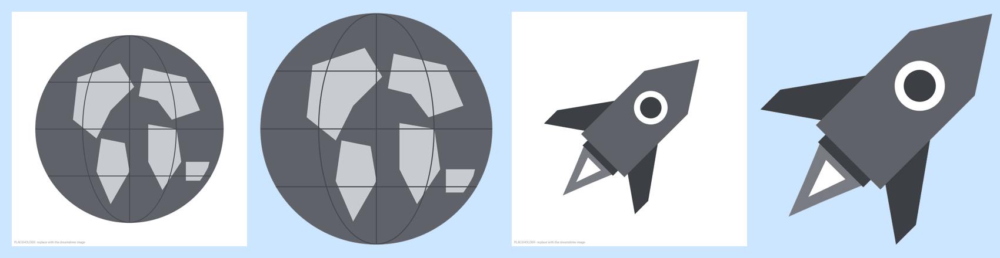
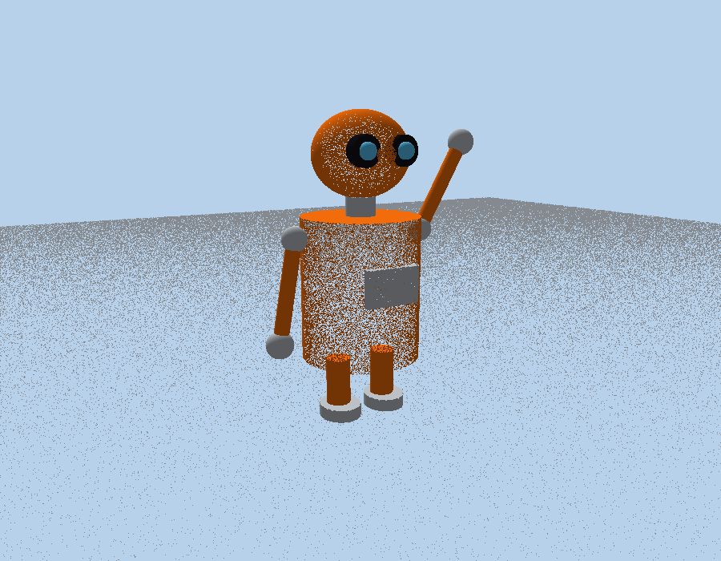

# BÁO CÁO BÀI THI THỰC HÀNH — UNITY

- **Họ tên:** Trần Thiên Bảo — **MSSV:** 23632721
- **Môn:** Công nghệ mới trong phát triển ứng dụng công nghệ thông tin
- **Công cụ:** Unity 2022.3.40f1 (Built-in Render Pipeline), C#

> **BẢN NHÁP.** Các mục có ghi `[CHÈN ẢNH]` cần chụp màn hình trong Unity Editor rồi chèn vào.
> Các ảnh trong `Exam_Report/images/` có tên `*placeholder*` / `*software_render*` là ảnh minh hoạ tạm,
> **không phải** ảnh chụp từ Unity.

Cấu trúc project:

```
Assets/Exam/
├── 2D/   (Câu 1 + Câu 2)  Scenes/, Scripts/, Sprites/
└── 3D/   (Câu 3)          Scenes/, Scripts/, Materials/
```

---

## Câu 1 (2 điểm, CLO3)

### 1a) Tải và xoá ảnh nền (background) của 2 ảnh

**Nguồn ảnh (theo đề):**
1. Tên lửa: https://www.dreamstime.com/stock-illustration-rocket-icon-flame-image42907314
2. Quả địa cầu: https://www.dreamstime.com/stock-illustration-globe-world-map-vector-icon-round-earth-flat-vector-illustratio-illustration-planet-business-concept-pictogram-white-background-image97519873

**Cách thực hiện:** hai ảnh đều là icon màu xám trên **nền trắng**. Em dùng script Python
`Exam_Report/tools/remove_background.py` (thư viện Pillow + numpy):

1. Pixel được coi là "nền" nếu gần trắng (cả 3 kênh R, G, B ≥ 225).
2. **Loang (flood fill) từ viền ảnh** qua các pixel nền. Vùng trắng nằm *bên trong* vật thể
   (cửa sổ tên lửa, lõi ngọn lửa) không nối với viền nên **được giữ lại**.
3. Pixel nền → alpha = 0 (trong suốt). Pixel ở mép vật thể → alpha trung gian để viền mượt.
4. Xoá các đốm nhỏ còn sót (ví dụ vết watermark), cắt ảnh sát vật thể, lưu **PNG có kênh alpha**.

Lệnh:
```
python remove_background.py rocket.jpg Rocket.png
python remove_background.py globe.jpg  Planet.png
```

**Import vào Unity:** `Assets/Exam/2D/Sprites/Planet.png`, `Rocket.png` với
*Texture Type = Sprite (2D and UI)*, *Sprite Mode = Single*, *Alpha Is Transparency = ✔*.

**Kết quả:** nền trắng bị xoá hoàn toàn. Trong scene, nền camera màu xanh nhạt, vật thể hiển thị
không còn khung trắng.



`[CHÈN ẢNH]` ảnh gốc tải từ dreamstime và ảnh PNG sau khi xoá nền (Inspector của sprite trong Unity).

### 1b) Hành tinh di chuyển từ trái sang phải với tốc độ chậm (2D)

- **Scene:** `Assets/Exam/2D/Scenes/Cau1_PlanetMove2D.unity`
- **Đối tượng:** `Main Camera` (Orthographic, size 5), `Planet` (SpriteRenderer + script `PlanetMove2D`).
- **Script `PlanetMove2D.cs`:** mỗi frame dịch chuyển theo trục X dương:

```csharp
transform.Translate(Vector3.right * moveSpeed * Time.deltaTime, Space.World);
```

  `moveSpeed = 0.5` đơn vị/giây (chậm: đi hết màn hình mất khoảng 28 giây). Nhân với `Time.deltaTime`
  để tốc độ không phụ thuộc FPS. Khi `x > rightX (7)` hành tinh quay lại `leftX (-7)` để xem lại được
  (tắt bằng ô `loop`).

`[CHÈN ẢNH]` 2–3 ảnh Game view ở các thời điểm khác nhau cho thấy hành tinh đi từ trái sang phải.

---

## Câu 2 (2 điểm, CLO4) — Tên lửa bay xung quanh hành tinh khi hành tinh bay chậm từ trái sang phải

- **Scene:** `Assets/Exam/2D/Scenes/Cau2_RocketOrbit2D.unity`
- **Đối tượng:** `Planet` (dùng lại `PlanetMove2D`, speed 0.5) và `Rocket` (script `RocketOrbit2D`,
  ô `Planet` đã gán sẵn đối tượng Planet).
- **Script `RocketOrbit2D.cs`:** tên lửa chạy trên đường tròn có **tâm là vị trí hiện tại của hành tinh**:

```csharp
angle += orbitSpeed * Time.deltaTime;                 // độ
float rad = angle * Mathf.Deg2Rad;
transform.position = planet.position + new Vector3(Mathf.Cos(rad), Mathf.Sin(rad), 0f) * radius;
transform.rotation = Quaternion.Euler(0f, 0f, angle + 90f - spriteNoseAngle); // mũi hướng theo chiều bay
```

  - `radius = 2.2`, `orbitSpeed = 45°/s` (1 vòng / 8 giây → chậm).
  - Dùng `LateUpdate` để đọc vị trí hành tinh **sau khi** hành tinh đã di chuyển trong frame đó.
  - Hướng bay là tiếp tuyến của đường tròn (góc + 90°); `spriteNoseAngle` là hướng mũi tên lửa trong ảnh
    gốc (ảnh hiện tại: mũi chỉ lên-phải = 45°).
- **Kết quả:** chuyển động tổng hợp = hành tinh trôi chậm sang phải + tên lửa bay vòng quanh hành tinh.

`[CHÈN ẢNH]` 3–4 ảnh Game view cho thấy tên lửa ở các phía khác nhau của hành tinh trong khi hành tinh dịch sang phải.

---

## Câu 3 (6 điểm, CLO3, CLO4) — Robot 3D

### 3.1 Thiết kế robot trong không gian 3 chiều

- **Scene:** `Assets/Exam/3D/Scenes/Cau3_Robot3D.unity` (Main Camera, Directional Light, Floor, Robot).
- Robot được dựng hoàn toàn từ **primitive** của Unity, vật liệu Standard trong `Assets/Exam/3D/Materials/`:

| Mô tả trong đề | Thực hiện |
|---|---|
| Màu cam sáng, nhỏ gọn, thân hình trụ | `Body`: Cylinder, bán kính 0.5, cao 1.2, vật liệu `Robot_Orange` |
| Đầu tròn | `Head/HeadShape`: Sphere (0.8 × 0.7 × 0.8), màu cam |
| Hai mắt lớn giống camera | `LeftEye`, `RightEye`: vỏ camera (Cylinder dẹt màu tối `Robot_EyeDark`) + ống kính (Sphere xanh bóng `Robot_EyeLens`) |
| Hình chữ nhật nhỏ trên ngực | `ChestPanel`: Cube dẹt màu bạc. Đề ghi *không cần thiết kế chi tiết giữa ngực* → chỉ làm tấm trơn |
| Tay dài màu cam, đầu tròn bạc, cử động chào hỏi | `LeftArm`, `RightArm`: khớp vai (pivot) + tay Cylinder cam + bàn tay Sphere bạc. Tay trái giơ lên như đang chào (giống ảnh), tay phải buông xuống. Xoay trục Z của pivot là tay cử động |
| Chân ngắn, đế tròn, đi trên mặt phẳng | `LeftLeg`, `RightLeg`: Cylinder ngắn + `Foot` Cylinder dẹt bạc (đế tròn), đứng trên `Floor` (Plane) |
| Cổ (dùng cho 3.2a) | `Neck`: pivot + `NeckShape` Cylinder bạc; `Head` là con của `Neck` |

Cây Hierarchy:

```
Robot                (RobotMovement)
├── Body
├── ChestPanel
├── Neck             (NeckRotate)
│   ├── NeckShape
│   └── Head
│       ├── HeadShape
│       ├── LeftEye  (CameraHousing, Lens)
│       └── RightEye (CameraHousing, Lens)
├── LeftArm  (Shoulder, ArmShape, Hand)
├── RightArm (Shoulder, ArmShape, Hand)
├── LeftLeg  (LegShape, Foot)
└── RightLeg (LegShape, Foot)
```

Hướng "phía trước" của robot là trục **+Z** (trục xanh dương), phía có hai mắt.



`[CHÈN ẢNH]` Scene view + Game view của robot trong Unity.

### 3.2 Lập trình điều khiển robot

**a) Robot xoay tròn cổ liên tục khi chương trình chạy** — script `NeckRotate.cs` gắn vào `Neck`:

```csharp
transform.Rotate(0f, rotateSpeed * Time.deltaTime, 0f, Space.Self);   // rotateSpeed = 90°/s
```

Chạy ngay khi nhấn Play, không cần phím. Vì `Head` là con của `Neck` nên cả đầu và hai mắt quay theo cổ.

**b) Nhấn W robot tiến tới, nhấn S robot lùi lại** — script `RobotMovement.cs` gắn vào `Robot`:

```csharp
float direction = 0f;
if (Input.GetKey(KeyCode.W)) direction += 1f;
if (Input.GetKey(KeyCode.S)) direction -= 1f;
transform.Translate(Vector3.forward * direction * moveSpeed * Time.deltaTime, Space.Self);   // moveSpeed = 2
```

Dùng Input Manager cũ (mặc định của Unity 2022.3). Cổ vẫn quay trong khi robot di chuyển, vì hai script độc lập
và gắn ở hai đối tượng khác nhau.

`[CHÈN ẢNH]` Ảnh đầu robot ở các góc quay khác nhau; ảnh robot trước/sau khi giữ W và S.

---

## Hình thức nộp

- File báo cáo này (xuất sang Word/PDF, chèn ảnh chụp màn hình).
- `23632721_TranThienBao_2D.unitypackage`: export thư mục `Assets/Exam/2D`.
- `23632721_TranThienBao_3D.unitypackage`: export thư mục `Assets/Exam/3D`.
